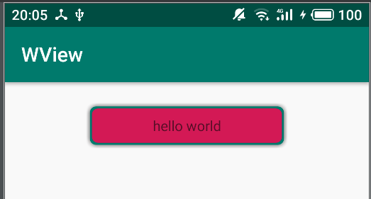

# 定制化View

**在开发过程中包体积越来越大，其中图片是一个大头，定制化View可以有效减少背景图的使用，
主要支持的功能：**

1，圆角设置（统一圆角，或四个角分别定制化）
2，边框支持（边框颜色，边框宽度）
3，阴影（四面阴影，或带方向阴影）
4，背景渐变色
5，按压状态背景
6，动态设置。

下面是效果图

### 多语言代码高亮 Codes

#### 行内代码 Inline code

执行命令：`npm install marked`

#### 缩进风格