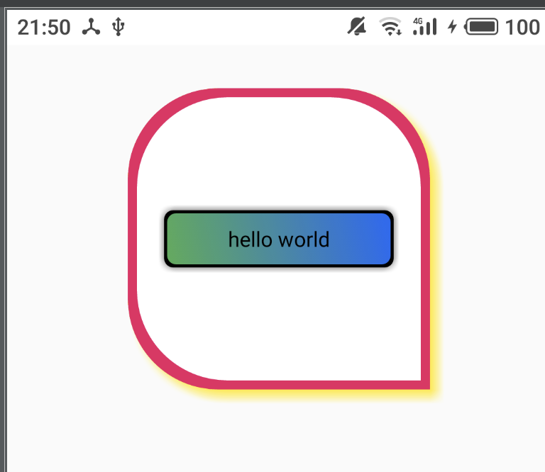

# 定制化View

**在开发过程中包体积越来越大，其中图片是一个大头，定制化View可以有效减少背景图的使用，
主要支持的功能：**

1. 圆角设置（统一圆角，或四个角分别定制化）
2. 边框支持（边框颜色，边框宽度）
3. 阴影（四面阴影，或带方向阴影）
4. 背景渐变色
5. 按压状态背景
6. 动态设置。

下面是效果图



#### xml使用如下
```xml
    <com.qukan.lib.ui.view.WTextView
        android:layout_width="200dp"
        android:layout_height="46dp"
        android:text="hello world"
        android:gravity="center"
        android:layout_gravity="center"
        android:onClick="onClick"
        app:w_radius="6dp"
        app:w_bg_start="#4CAF50"
        app:w_bg_end="#2167F3"
        app:w_bg_orientation="left_to_right"
        app:w_press_bg="#ffffff"
        app:w_border_color="#E91E63"
        app:w_border_width="2dp"
        app:w_shadow_color="#5F5E5E"
        app:w_shadow_width="4dp"/>
```


#### 代码动态设置如下

```java
        WTextView tv = findViewById(R.id.tv);
        tv.getViewHelper()
                .setRadius(10)
                .setBorder(3, Color.RED)
                .setShadow(4, Color.YELLOW, ViewOrientation.ALL)
                .setBgColor(Color.BLUE, Color.GREEN, ViewOrientation.LEFT_TO_RIGHT)
                .setPressBgColor(Color.GREEN, Color.BLUE, ViewOrientation.LEFT_TO_RIGHT)
                .invalidate();
```

、
